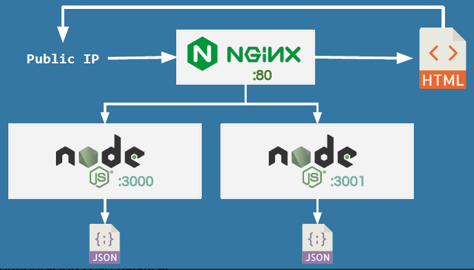

# Load Balancing Node.js Applications with NGINX and Docker

## Configuración 4 



Ejemplo de **server nodejs**:

```javascript
const express = require('express')
const app = express()

let ejs = require('ejs') 
let fs = require('fs')

const port = process.env.PORT

let objectSentFromServer = [...] 

app.get('/', (req, res) => {
    fs.readFile(__dirname + '/index.html', 'utf-8', (err, html) => {
      res.send(ejs.render(html, { objectSentFromServer: objectSentFromServer}))
    })
})

app.listen(port, () => {
  console.log(`Example app listening at http://localhost:${port}`)
})
```

**Configuración nginx.conf - Load balancer**

```javascript
upstream node_cluster {
    server 172.17.0.2:3000 weight=1;
    server 172.17.0.3:3001 weight=1;
    server 172.17.0.4:3002 weight=1;
}

server {
    listen 80;
    server_name api.dominio.com;

    location / {
        proxy_set_header X-Real-IP $remote_addr;
        proxy_set_header X-Forwarded-For $proxy_add_x_forwarded_for;
        proxy_set_header Host $http_host;
        proxy_pass http://node_cluster/;
        proxy_http_version 1.1;
        proxy_set_header Upgrade $http_upgrade;
        proxy_read_timeout 5m;
        proxy_set_header Connection "upgrade";
    }
}
```

